# Chart 1: Driver.py - Main System Orchestrator

```mermaid
flowchart TD
    A[Driver.__init__] --> B{Load Config}
    B --> C[Setup Multiprocessing Manager]
    C --> D[Initialize Shared State]
    D --> E[Create Worker Assignment Round-Robin]
    
    D --> D1[shared_state active_trades = 0]
    D --> D2[shared_state active_order_ids = manager.list]
    D --> D3[shared_state order_status_dict = manager.dict]
    D --> D4[shared_state failed_trades = manager.dict]
    D --> D5[shared_state incomplete_entry_trades = manager.dict]
    D --> D6[shared_state incomplete_exit_trades = manager.dict]
    D --> D7[shared_state incomplete_takeprofit_trades = manager.dict]
    
    E --> F[Get Margin Data from OpenAlgo API]
    F --> F1{API Response OK?}
    F1 -->|Yes| G[Store margin_dict in shared_state]
    F1 -->|No| F2[Error Handling]
    
    G --> H[Initialize RiskManager]
    H --> H1[total_capital from config]
    H --> H2[risk_per_trade from config]
    H --> H3[max_allocation from config]
    H --> H4[max_active_trades from config]
    
    H --> I[Initialize TradeManager]
    I --> I1[Pass risk_manager reference]
    I --> I2[Pass shared_state & shared_lock]
    I --> I3[Pass config & margin_dict]
    I --> I4[Pass manager for multiprocessing]
    
    I --> J[Create 8 Worker Processes]
    J --> J1[For each worker i in range 8]
    J1 --> J2[Create Queue for worker i]
    J1 --> J3[Assign symbols round-robin]
    J1 --> J4[Create Worker instance]
    J4 --> J5[Pass worker_id, symbols, queue]
    J4 --> J6[Pass trade_signal_queue shared]
    J4 --> J7[Pass config, margin_dict]
    J4 --> J8[Pass risk_manager, shared_state, shared_lock]
    
    J --> K[Initialize DataDispatcher]
    K --> K1[Register worker queues]
    K --> K2[Create symbol -> worker mapping]
    
    K --> L[Initialize OrderStatusManager]
    L --> L1[Setup polling interval = 1s]
    L --> L2[Setup OpenAlgo order status URL]
    L --> L3[Setup API key from env]
    
    L --> M[Validate Shared State]
    M --> M1{Validation Pass?}
    M1 -->|Yes| N[Start Health Monitoring Thread]
    M1 -->|No| M2[Log Error - May Cause Issues]
    
    N --> END1[Driver Ready for run]
    M2 --> END1
    
    subgraph OrderStatusManager_Flow
        OSM1[OrderStatusManager.poll_order_status]
        OSM1 --> OSM2{while running?}
        OSM2 -->|Yes| OSM3[Get active_order_ids from shared_state with lock]
        OSM3 --> OSM4[For each order_id]
        OSM4 --> OSM5[Create payload with apikey, orderid]
        OSM4 --> OSM6[POST to OpenAlgo orderstatus API]
        OSM6 --> OSM7{Response 200?}
        OSM7 -->|Yes| OSM8[Store response in status_dict]
        OSM7 -->|No| OSM9[Store error in status_dict]
        OSM8 --> OSM10[Update shared_state order_status_dict with lock]
        OSM9 --> OSM10
        OSM10 --> OSM11[Sleep poll_interval]
        OSM11 --> OSM2
        OSM2 -->|No| OSM12[Stop polling]
    end
    
    subgraph DataDispatcher_Flow
        DD1[DataDispatcher.dispatch]
        DD1 --> DD2[Get symbol from data]
        DD2 --> DD3[Get worker_idx from worker_assignment]
        DD3 --> DD4{worker_idx valid?}
        DD4 -->|Yes| DD5[Put data in worker_queues worker_idx]
        DD4 -->|No| DD6[Log error - no worker for symbol]
    end
    
    subgraph Driver_Run_Flow
        DR1[Driver.run] --> DR2[start_workers]
        DR2 --> DR3[For each worker: worker.start]
        DR3 --> DR4[Start run_data_feed in daemon Thread]
        DR4 --> DR5[Start process_trade_signals main loop]
        
        DR4 --> DR4A{LIVE_DATA from env?}
        DR4A -->|True| DR4B[Initialize FyersBroker WebSocket]
        DR4B --> DR4C[Set on_message = dispatcher.dispatch]
        DR4C --> DR4D[Connect FyersBroker WebSocket]
        DR4A -->|False| DR4E[Initialize SimulatedWebSocket]
        DR4E --> DR4F[Set on_message = dispatcher.dispatch]
        DR4F --> DR4G[Connect Simulated WebSocket]
        DR4G --> DR4H[Subscribe to symbols list]
        
        DR5 --> DR5A[Start OrderStatusManager]
        DR5A --> DR5B{while True}
        DR5B --> DR5C[Get signal from trade_signal_queue timeout=1]
        DR5C --> DR5D{Signal received?}
        DR5D -->|Yes| DR5E[Acquire driver lock]
        DR5E --> DR5F[trade_manager.process_signal]
        DR5F --> DR5B
        DR5D -->|timeout| DR5B
        DR5B -->|KeyboardInterrupt| DR5G[Call shutdown]
    end
    
    subgraph Driver_Shutdown_Flow
        DS1[Driver.shutdown] --> DS2[Set running = False]
        DS2 --> DS3[For each worker]
        DS3 --> DS4{worker.is_alive?}
        DS4 -->|Yes| DS5[worker.terminate]
        DS5 --> DS6[worker.join timeout=5]
        DS6 --> DS7{Still alive?}
        DS7 -->|Yes| DS8[worker.kill - Force]
        DS7 -->|No| DS9[Continue to next worker]
        DS8 --> DS9
        DS4 -->|No| DS9
        DS9 --> DS10[Close worker queues]
        DS10 --> DS11[join_thread on queues]
        DS11 --> DS12[Log shutdown complete]
    end
```

# Chart 2: Worker.py - Market Data Processing & Signal Generation

```mermaid
flowchart TD
    A[Worker.__init__] --> B[Store worker_id, symbols, queues]
    B --> C[Store config, margin_dict, risk_manager]
    C --> D[Store shared_state, shared_lock]
    D --> E[Initialize md_handler = None]
    E --> F[Create process Lock]
    
    F --> G[Worker.run]
    G --> G1[Create MarketDataHandler instance]
    G1 --> G2[Pass signal_processor = CurrentStrategy]
    G1 --> G3[Pass aggregation_resolution = None]
    G1 --> G4[Pass risk_manager, shared_state, shared_lock]
    
    G --> G5[Set md_handler.trade_signal_queue = shared queue]
    G5 --> G6[Start md_handler.process_queue in daemon Thread]
    G6 --> G7[Initialize monitoring variables]
    G7 --> G8[last_shared_state_print = time.time]
    G7 --> G9[shared_state_print_interval = 30s]
    G7 --> G10[iteration_count = 0]
    
    G6 --> MAIN_LOOP[Main Worker Loop]
    
    subgraph MAIN_LOOP[Worker Main Loop]
        WML1{while True}
        WML1 --> WML2[iteration_count += 1]
        WML2 --> WML3[current_time = time.time]
        WML3 --> WML4{current_time - last_print >= 30s?}
        WML4 -->|Yes| WML5[print_shared_state_detailed]
        WML5 --> WML6[last_shared_state_print = current_time]
        WML4 -->|No| WML7{iteration_count % 100 == 0?}
        WML6 --> WML7
        WML7 -->|Yes| WML8[Log brief shared state keys]
        WML7 -->|No| WML9[Get data from in_queue timeout=5]
        WML8 --> WML9
        WML9 --> WML10{Data received?}
        WML10 -->|Yes| WML11{data symbol in worker symbols?}
        WML11 -->|Yes| WML12[md_handler.data_queue.put data]
        WML11 -->|No| WML1
        WML10 -->|timeout| WML1
        WML12 --> WML1
    end
    
    subgraph MarketDataHandler_Init
        MDH1[MarketDataHandler.__init__]
        MDH1 --> MDH2[Create process-local DB connection]
        MDH2 --> MDH3[engine, session = setup]
        MDH3 --> MDH4[db_handler = DBHandler engine]
        MDH4 --> MDH5[data_queue = SimpleQueue]
        MDH5 --> MDH6[running = True, batch_size = 1]
        MDH6 --> MDH7[Store aggregation_resolution]
        MDH7 --> MDH8[aggregated_data = dict]
        MDH8 --> MDH9[signal_processors = dict]
        MDH9 --> MDH10[Store risk_manager, shared_state, shared_lock]
    end
    
    subgraph MarketDataHandler_ProcessQueue
        PQ1[MarketDataHandler.process_queue]
        PQ1 --> PQ2{while self.running?}
        PQ2 -->|Yes| PQ3[batch = empty list]
        PQ3 --> PQ4{len batch < batch_size?}
        PQ4 -->|Yes| PQ5[data = data_queue.get timeout=5]
        PQ5 --> PQ6{Valid dict with symbol?}
        PQ6 -->|Yes| PQ7[batch.append data]
        PQ6 -->|No| PQ8[Log invalid data error]
        PQ7 --> PQ4
        PQ8 --> PQ4
        PQ4 -->|No| PQ9{batch not empty?}
        PQ5 -->|timeout| PQ9
        PQ9 -->|Yes| PQ10{aggregation_resolution AND no active trades?}
        PQ10 -->|Yes| PQ11[aggregate_data_and_process_batch]
        PQ10 -->|No| PQ12[Insert MarketData to DB]
        PQ12 --> PQ13[process_batch]
        PQ11 --> PQ13
        PQ13 --> PQ2
        PQ9 -->|No| PQ2
        PQ2 -->|No| PQ14[Stop processing]
    end
    
    subgraph ProcessBatch_DetailedFlow
        PB1[process_batch batch]
        PB1 --> PB2[For each data in batch]
        PB2 --> PB3{data is valid dict?}
        PB3 -->|No| PB4[Log error, continue]
        PB3 -->|Yes| PB5[symbol = data.get symbol]
        PB5 --> PB6{symbol exists?}
        PB6 -->|No| PB7[Log no symbol error, continue]
        PB6 -->|Yes| PB8{symbol in signal_processors?}
        PB8 -->|No| PB9[Create CurrentStrategy symbol]
        PB9 --> PB10[signal_processors symbol = processor]
        PB8 -->|Yes| PB11[Check Force Exit Triggers]
        PB10 --> PB11
        
        PB11 --> PB12{force_exit_triggered_symbols not empty?}
        PB12 -->|Yes| PB13{symbol in force_exit_triggered?}
        PB13 -->|Yes| PB14[Log Force Exit Triggered]
        PB14 --> PB15[signal_processors symbol._discard_signal]
        PB15 --> PB16[signal_processors symbol._reset_position_tracking]
        PB13 -->|No| PB17[Check Incomplete Entry Trades]
        PB12 -->|No| PB17
        PB16 --> PB17
        
        PB17 --> PB18[incomplete_info = check_incomplete_trades symbol]
        PB18 --> PB19{incomplete_info.get entry?}
        PB19 -->|Yes| PB20[Log Discarding signal BEFORE run]
        PB20 --> PB21[signal_processors symbol._discard_signal]
        PB21 --> PB22[signal_processors symbol._reset_position_tracking]
        PB22 --> PB23[continue to next data]
        PB19 -->|No| PB24[results = signal_processors symbol.run data]
        
        PB24 --> PB25{results exists?}
        PB25 -->|Yes| PB26[processed_signal = apply_signal_management symbol, results]
        PB26 --> PB27{processed_signal exists?}
        PB27 -->|Yes| PB28[trade_signal_queue.put processed_signal]
        PB28 --> PB29[result_copy = processed_signal.copy]
        PB29 --> PB30[Remove trade_id if exists]
        PB30 --> PB31[db_handler.insert_records StockSignals]
        PB27 -->|No| PB32[Log signal discarded]
        PB25 -->|No| PB33[Continue to next data]
        PB31 --> PB33
        PB32 --> PB33
        PB4 --> PB33
        PB7 --> PB33
        PB23 --> PB33
    end
    
    subgraph CheckIncompleteTrades_Flow
        CIT1[check_incomplete_trades symbol]
        CIT1 --> CIT2{shared_state and shared_lock exist?}
        CIT2 -->|No| CIT3[Return has_incomplete: False]
        CIT2 -->|Yes| CIT4[Initialize incomplete_info dict]
        CIT4 --> CIT5[Acquire shared_lock]
        CIT5 --> CIT6[incomplete_entry = shared_state.get incomplete_entry_trades]
        CIT6 --> CIT7{symbol in incomplete_entry?}
        CIT7 -->|Yes| CIT8[incomplete_info entry = incomplete_entry symbol]
        CIT7 -->|No| CIT9[incomplete_exit = shared_state.get incomplete_exit_trades]
        CIT8 --> CIT9
        CIT9 --> CIT10{symbol in incomplete_exit?}
        CIT10 -->|Yes| CIT11[incomplete_info exit = incomplete_exit symbol]
        CIT10 -->|No| CIT12[incomplete_tp = shared_state.get incomplete_takeprofit_trades]
        CIT11 --> CIT12
        CIT12 --> CIT13{symbol in incomplete_tp?}
        CIT13 -->|Yes| CIT14[incomplete_info take_profit = incomplete_tp symbol]
        CIT13 -->|No| CIT15[Release shared_lock]
        CIT14 --> CIT15
        CIT15 --> CIT16[Return incomplete_info]
    end
    
    subgraph ApplySignalManagement_Flow
        ASM1[apply_signal_management symbol, signal]
        ASM1 --> ASM2{signal exists?}
        ASM2 -->|No| ASM3[Return None]
        ASM2 -->|Yes| ASM4[signal_type = signal.get type]
        ASM4 --> ASM5{signal_type == entry?}
        ASM5 -->|Yes| ASM6[Return signal - already handled before run]
        ASM5 -->|No| ASM7{signal_type in exit, take_profit?}
        ASM7 -->|Yes| ASM8[Return handle_exit_or_takeprofit_signal]
        ASM7 -->|No| ASM9[Return signal - pass through]
    end
    
    subgraph HandleExitTakeProfit_Flow
        HETP1[handle_exit_or_takeprofit_signal symbol, new_signal]
        HETP1 --> HETP2[signal_type = new_signal.get type]
        HETP2 --> HETP3{signal_type in exit, take_profit?}
        HETP3 -->|No| HETP4[Return new_signal]
        HETP3 -->|Yes| HETP5[incomplete_info = check_incomplete_trades symbol]
        HETP5 --> HETP6[incomplete_trade = incomplete_info.get signal_type]
        HETP6 --> HETP7{incomplete_trade exists?}
        HETP7 -->|No| HETP8[Return new_signal]
        HETP7 -->|Yes| HETP9[previous_signal = incomplete_trade signal]
        HETP9 --> HETP10[merged_signal = new_signal.copy]
        HETP10 --> HETP11[Define merge_keys list]
        HETP11 --> HETP12[For each key in merge_keys]
        HETP12 --> HETP13{key in previous_signal AND key not in merged_signal?}
        HETP13 -->|Yes| HETP14[merged_signal key = previous_signal key]
        HETP14 --> HETP15[Log merged key info]
        HETP13 -->|No| HETP16[Continue to next key]
        HETP15 --> HETP16
        HETP16 --> HETP17[attempt_count = incomplete_trade.attempt_count + 1]
        HETP17 --> HETP18[Log retrying signal with attempt count]
        HETP18 --> HETP19[Return merged_signal]
    end
```

# Chart 3: Risk Manager - Capital & Risk Management System

```mermaid
flowchart TD
    A[RiskManager.__init__] --> B[Store Configuration Parameters]
    B --> B1[total_capital from config]
    B --> B2[risk_per_trade percentage]
    B --> B3[max_allocation percentage]
    B --> B4[max_active_trades limit]
    B --> B5[trade_counter initialization]
    
    B --> C[Initialize Internal State]
    C --> C1[start_capital = total_capital]
    C --> C2[active_trades = OrderedDict]
    C --> C3[lock = multiprocessing.Lock]
    C --> C4[margin_dict = empty dict]
    C --> C5[most_recent_exit_trade_id = 0]
    C --> C6[global_returns = 0.0]
    C --> C7[halt_trading = False]
    C --> C8[active_trade_symbols = set]
    C --> C9[price_tracker = dict]
    C --> C10[force_exit_triggered_symbols = dict]
    
    C --> D[initialize_db Method]
    D --> D1[engine, session = setup]
    D --> D2[db_handler = DBHandler engine]
    D --> D3{max_trade_id is None?}
    D3 -->|Yes| D4[max_trade_id = db_handler.get_max_trade_id TradeLog]
    D3 -->|No| D5[Return db_handler]
    D4 --> D5
    
    D --> ASSESS_TRADE[assess_trade Method]
    
    subgraph ASSESS_TRADE[assess_trade Flow]
        AT1[assess_trade symbol, entry_price, stop_loss]
        AT1 --> AT2[margin_val = margin_dict.get symbol, 1]
        AT2 --> AT3[units = calculate_position_size entry_price, stop_loss, margin_val, symbol]
        AT3 --> AT4[margin_discount_price = entry_price / margin_val]
        AT4 --> AT5[allocated = units * margin_discount_price]
        
        AT5 --> AT6{units <= 0?}
        AT6 -->|Yes| AT7[Return eligible: False, reason: Zero units calculated]
        AT6 -->|No| AT8{available_capital < allocated?}
        AT8 -->|Yes| AT9[Return eligible: False, reason: Insufficient capital]
        AT8 -->|No| AT10{len active_trades >= max_active_trades?}
        AT10 -->|Yes| AT11[Return eligible: False, reason: Max active trades reached]
        AT10 -->|No| AT12{symbol in active_trade_symbols?}
        AT12 -->|Yes| AT13[Return eligible: False, reason: Already trading symbol]
        AT12 -->|No| AT14[Return eligible: True, units: units, allocated: allocated, reason: Trade approved]
    end
    
    subgraph CALCULATE_POSITION_SIZE[calculate_position_size Flow]
        CPS1[calculate_position_size entry_price, stop_loss, margin_val, symbol]
        CPS1 --> CPS2[avail = total_capital]
        CPS2 --> CPS3[risk_amount = avail * risk_per_trade]
        CPS3 --> CPS4[price_risk = abs entry_price - stop_loss]
        CPS4 --> CPS5[margin_discount_price = entry_price / margin_val]
        CPS5 --> CPS6{price_risk <= 0?}
        CPS6 -->|Yes| CPS7[Log Non-positive price risk]
        CPS7 --> CPS8[Return 0 units]
        CPS6 -->|No| CPS9[units_risk = risk_amount / price_risk]
        CPS9 --> CPS10[units_afford = available_capital / margin_discount_price]
        CPS10 --> CPS11[raw_units = min units_risk, units_afford]
        CPS11 --> CPS12[max_units_cap = max_allocation / margin_discount_price]
        CPS12 --> CPS13[final_units = min raw_units, max_units_cap]
        CPS13 --> CPS14[Log calculated units with breakdown]
        CPS14 --> CPS15[Return int final_units]
    end
    
    subgraph AVAILABLE_CAPITAL[available_capital Property]
        AC1[available_capital Property]
        AC1 --> AC2[used_capital = sum trade allocated for trade in active_trades.values]
        AC2 --> AC3[available = total_capital - used_capital]
        AC3 --> AC4[Log available capital]
        AC4 --> AC5[Return available]
    end
    
    subgraph REGISTER_TRADE_ENTRY[register_trade_entry Flow]
        RTE1[register_trade_entry trade_record]
        RTE1 --> RTE2[db_handler = initialize_db]
        RTE2 --> RTE3[Acquire lock]
        RTE3 --> RTE4[trade_counter += 1]
        RTE4 --> RTE5[trade_id = trade_counter]
        RTE5 --> RTE6[trade_record trade_id = trade_id]
        RTE6 --> RTE7[active_trades trade_id = trade_record]
        RTE7 --> RTE8[active_trade_symbols.add trade_record symbol]
        RTE8 --> RTE9[Release lock]
        
        RTE9 --> RTE10[Create ActiveTrades DB record]
        RTE10 --> RTE11[active_trade = ActiveTrades **trade_record]
        RTE11 --> RTE12[db_handler.insert_records active_trade]
        RTE12 --> RTE13[Log trade entry registered]
        RTE13 --> RTE14[Return trade_id]
    end
    
    subgraph REGISTER_FULL_EXIT[register_full_trade_exit Flow]
        RFE1[register_full_trade_exit trade_record]
        RFE1 --> RFE2[db_handler = initialize_db]
        RFE2 --> RFE3[trade_id = trade_record trade_id]
        RFE3 --> RFE4[Acquire lock]
        RFE4 --> RFE5{trade_id in active_trades?}
        RFE5 -->|No| RFE6[Log warning - trade not in active trades]
        RFE6 --> RFE7[Release lock, Return]
        RFE5 -->|Yes| RFE8[active_trade = active_trades trade_id]
        RFE8 --> RFE9[allocated = active_trade allocated]
        RFE9 --> RFE10[realized_pnl = trade_record realized_pnl]
        RFE10 --> RFE11[total_capital += allocated + realized_pnl]
        RFE11 --> RFE12[del active_trades trade_id]
        RFE12 --> RFE13[active_trade_symbols.discard trade_record symbol]
        RFE13 --> RFE14[most_recent_exit_trade_id = trade_id]
        RFE14 --> RFE15[Release lock]
        
        RFE15 --> RFE16[Create TradeLog DB record]
        RFE16 --> RFE17[trade_log = TradeLog **trade_record]
        RFE17 --> RFE18[db_handler.insert_records trade_log]
        
        RFE18 --> RFE19[Create CapitalLog DB record]
        RFE19 --> RFE20[capital_log = CapitalLog trade_id, total_capital, global_returns]
        RFE20 --> RFE21[db_handler.insert_records capital_log]
        RFE21 --> RFE22[Log full trade exit completed]
    end
    
    subgraph REGISTER_PARTIAL_EXIT[register_partial_trade_exit Flow]
        RPE1[register_partial_trade_exit trade_record]
        RPE1 --> RPE2[db_handler = initialize_db]
        RPE2 --> RPE3[trade_id = trade_record trade_id]
        RPE3 --> RPE4[Acquire lock]
        RPE4 --> RPE5{trade_id in active_trades?}
        RPE5 -->|No| RPE6[Log warning - trade not in active trades]
        RPE6 --> RPE7[Release lock, Return trade_id]
        RPE5 -->|Yes| RPE8[active_trade = active_trades trade_id]
        RPE8 --> RPE9[Update active_trade with partial exit data]
        RPE9 --> RPE10[active_trades trade_id = active_trade]
        RPE10 --> RPE11[Release lock]
        
        RPE11 --> RPE12[Update ActiveTrades DB record]
        RPE12 --> RPE13[db_handler.update_active_trade trade_record]
        RPE13 --> RPE14[Log partial trade exit registered]
        RPE14 --> RPE15[Return trade_id]
    end
    
    subgraph HALT_TRADING_CHECK[halt_trading_check Flow]
        HTC1[halt_trading_check]
        HTC1 --> HTC2[current_returns = get_current_global_returns]
        HTC2 --> HTC3{max_global_loss_cap not None?}
        HTC3 -->|Yes| HTC4{current_returns < max_global_loss_cap?}
        HTC4 -->|Yes| HTC5[halt_trading = True]
        HTC5 --> HTC6[halt_trading_reason = Global loss cap breached]
        HTC4 -->|No| HTC7{max_global_profit_cap not None?}
        HTC3 -->|No| HTC7
        HTC7 -->|Yes| HTC8{current_returns > max_global_profit_cap?}
        HTC8 -->|Yes| HTC9[halt_trading = True]
        HTC9 --> HTC10[halt_trading_reason = Global profit cap reached]
        HTC8 -->|No| HTC11[halt_trading = False]
        HTC7 -->|No| HTC11
        HTC6 --> HTC12[Return halt_trading, halt_trading_reason]
        HTC10 --> HTC12
        HTC11 --> HTC12
    end
    
    subgraph TRACK_PRICES[track_prices Flow]
        TP1[track_prices signal]
        TP1 --> TP2[symbol = signal symbol]
        TP2 --> TP3[price = signal price]
        TP3 --> TP4[price_tracker symbol = price]
        TP4 --> TP5[Log price tracked for symbol]
    end
    
    subgraph GET_GLOBAL_RETURNS[get_current_global_returns Flow]
        GGR1[get_current_global_returns]
        GGR1 --> GGR2[global_returns = total_capital - start_capital / start_capital * 100]
        GGR2 --> GGR3[Log global returns calculation]
        GGR3 --> GGR4[Return global_returns]
    end
    
    subgraph GET_SYMBOL_RETURNS[get_current_returns_for_symbol Flow]
        GSR1[get_current_returns_for_symbol symbol, current_price]
        GSR1 --> GSR2[Acquire lock]
        GSR2 --> GSR3[Initialize returns = 0.0]
        GSR3 --> GSR4[For each trade_id, trade in active_trades.items]
        GSR4 --> GSR5{trade symbol == symbol?}
        GSR5 -->|Yes| GSR6{trade position_type == long?}
        GSR6 -->|Yes| GSR7[pnl = current_price - trade entry_price * remaining_position_size]
        GSR6 -->|No| GSR8[pnl = trade entry_price - current_price * remaining_position_size]
        GSR7 --> GSR9[returns += pnl / trade allocated * 100]
        GSR8 --> GSR9
        GSR5 -->|No| GSR10[Continue to next trade]
        GSR9 --> GSR10
        GSR10 --> GSR11[Release lock]
        GSR11 --> GSR12[Return returns]
    end
```

# Chart 4: Trade Manager - Order Execution & Incomplete Trade Management

```mermaid
flowchart TD
    A[TradeManager.__init__] --> B[Initialize Dependencies]
    B --> B1[Store risk_manager reference]
    B --> B2[Store trade_executor reference]
    B --> B3[Store max_active_trades limit]
    B --> B4[Store config parameters]
    B --> B5[Store margin_dict]
    B --> B6[Create local Lock]
    B --> B7[Store shared_lock for multiprocessing]
    B --> B8[Store shared_state reference]
    B --> B9[Store manager for multiprocessing objects]
    
    B --> C[Initialize OpenAlgo Client]
    C --> C1[openalgo_client = api APP_KEY, HOST_SERVER]
    C --> C2[Extract slippage from config]
    C --> C3[Extract commission from config]
    C --> C4[Initialize trade_tracker = dict]
    
    C --> PROCESS_SIGNAL[process_signal Main Entry Point]
    
    subgraph PROCESS_SIGNAL[process_signal Flow]
        PS1[process_signal signal]
        PS1 --> PS2[Acquire local lock]
        PS2 --> PS3[Log TradeTracker state]
        PS3 --> PS4[Update shared_state failed_trades with lock]
        PS4 --> PS5[risk_manager.track_prices signal]
        PS5 --> PS6[returns = risk_manager.get_current_global_returns]
        PS6 --> PS7[returns_stock = risk_manager.get_current_returns_for_symbol]
        PS7 --> PS8[Log current prices and returns]
        
        PS8 --> PS9[Convert signal time to datetime IST]
        PS9 --> PS10{max_loss_cap_stock not None?}
        PS10 -->|Yes| PS11{returns_stock < max_loss_cap_stock AND force_exit_on_cap?}
        PS11 -->|Yes| PS12[Log Max Loss Threshold Breached]
        PS12 --> PS13[Get trade_record from active_trades]
        PS13 --> PS14{trade_record exists?}
        PS14 -->|Yes| PS15[Convert signal to exit type]
        PS15 --> PS16[Set position_to_close, current_position]
        PS16 --> PS17[Store in force_exit_triggered_symbols]
        PS14 -->|No| PS18{max_profit_cap_stock not None?}
        PS11 -->|No| PS18
        PS10 -->|No| PS18
        PS17 --> PS18
        
        PS18 -->|Yes| PS19{returns_stock > max_profit_cap_stock AND force_exit_on_cap?}
        PS19 -->|Yes| PS20[Log Max Profit Threshold Attained]
        PS20 --> PS21[Get trade_record from active_trades]
        PS21 --> PS22{trade_record exists?}
        PS22 -->|Yes| PS23[Convert signal to exit type]
        PS23 --> PS24[Set position_to_close, current_position]
        PS24 --> PS25[Store in force_exit_triggered_symbols]
        PS22 -->|No| PS26{signal type exists?}
        PS19 -->|No| PS26
        PS18 -->|No| PS26
        PS25 --> PS26
        
        PS26 -->|Yes| PS27{signal current_position == long?}
        PS27 -->|Yes| LONG_POSITION_FLOW
        PS27 -->|No| SHORT_POSITION_FLOW
        PS26 -->|No| PS28[Log No Valid Signal]
    end
    
    subgraph LONG_POSITION_FLOW[Long Position Processing]
        LPF1{signal type?}
        LPF1 -->|entry| LONG_ENTRY_FLOW
        LPF1 -->|take_profit| LONG_TAKEPROFIT_FLOW
        LPF1 -->|exit| LONG_EXIT_FLOW
    end
    
    subgraph LONG_ENTRY_FLOW[Long Entry Processing]
        LEF1[Check halt_trading_check]
        LEF1 --> LEF2{halt_trading?}
        LEF2 -->|Yes| LEF3[Log Trading stopped]
        LEF2 -->|No| LEF4[assessment = risk_manager.assess_trade]
        LEF4 --> LEF5{assessment eligible?}
        LEF5 -->|No| LEF6[Log Trade entry rejected]
        LEF5 -->|Yes| LEF7[position_size = risk_manager.calculate_position_size]
        LEF7 --> LEF8[Create trade_record dictionary]
        LEF8 --> LEF9[Initialize trade record fields]
        
        LEF9 --> LEF10[Execute OpenAlgo placeorder]
        LEF10 --> LEF11[action=BUY, exchange=NSE, price_type=MARKET, product=MIS]
        LEF11 --> LEF12[symbol=get_oa_symbol, quantity=position_size]
        LEF12 --> LEF13[Log Response for Entry Trade]
        
        LEF13 --> LEF14{response.orderid exists?}
        LEF14 -->|Yes| LEF15[order_id = response.orderid]
        LEF15 --> LEF16[Execute openalgo_client.orderstatus]
        LEF16 --> LEF17[order_id=order_id, strategy=Python]
        LEF17 --> LEF18[Log Order Status Response]
        LEF18 --> LEF19{order_status in complete, executed, filled?}
        LEF19 -->|Yes| LEF20[order_completed = True]
        LEF19 -->|No| LEF21[order_completed = False]
        LEF14 -->|No| LEF21
        
        LEF20 --> LEF22[trade_record status = completed]
        LEF22 --> LEF23[trade_id = risk_manager.register_trade_entry]
        LEF23 --> LEF24[trade_tracker symbol = trade_id]
        LEF24 --> LEF25[trade_record.order_id.append orderid]
        LEF25 --> LEF26[clear_incomplete_trade symbol, entry]
        
        LEF21 --> LEF27[Log Trade entry failed - order not completed]
        LEF27 --> LEF28[track_incomplete_trade signal, entry, order_id, reason]
        LEF28 --> LEF29[Update shared_state failed_trades]
        LEF29 --> LEF30{symbol in trade_tracker?}
        LEF30 -->|Yes| LEF31[del trade_tracker symbol]
        LEF30 -->|No| LEF32[Continue processing]
        LEF31 --> LEF32
    end
    
    subgraph LONG_TAKEPROFIT_FLOW[Long Take Profit Processing]
        LTP1[Get trade_record from active_trades]
        LTP1 --> LTP2[Update estimated fields]
        LTP2 --> LTP3[Calculate position_closed_tp]
        LTP3 --> LTP4[Calculate realized_pnl_tp_estimated]
        
        LTP4 --> LTP5[Execute OpenAlgo placeorder]
        LTP5 --> LTP6[action=SELL, exchange=NSE, price_type=MARKET, product=MIS]
        LTP6 --> LTP7[quantity=position_closed_tp]
        LTP7 --> LTP8[Log Response for Take Profit Trade]
        
        LTP8 --> LTP9{response.orderid exists?}
        LTP9 -->|Yes| LTP10[Execute orderstatus check]
        LTP10 --> LTP11{order completed?}
        LTP11 -->|Yes| LTP12[Update trade_record with actual values]
        LTP12 --> LTP13[risk_manager.register_partial_trade_exit]
        LTP13 --> LTP14[clear_incomplete_trade symbol, take_profit]
        LTP11 -->|No| LTP15[track_incomplete_trade signal, take_profit, order_id]
        LTP9 -->|No| LTP15
        LTP15 --> LTP16[Update shared_state failed_trades]
    end
    
    subgraph LONG_EXIT_FLOW[Long Exit Processing]
        LEX1[Get trade_record from active_trades]
        LEX1 --> LEX2[Calculate realized_pnl_estimated]
        LEX2 --> LEX3[Update exit_price_estimated, exit_time_estimated]
        
        LEX3 --> LEX4[Execute OpenAlgo placeorder]
        LEX4 --> LEX5[action=SELL, exchange=NSE, price_type=MARKET, product=MIS]
        LEX5 --> LEX6[quantity=position_size - position_closed_tp]
        LEX6 --> LEX7[Log Response for Exit Trade]
        
        LEX7 --> LEX8{response.orderid exists?}
        LEX8 -->|Yes| LEX9[Execute orderstatus check]
        LEX9 --> LEX10{order completed?}
        LEX10 -->|Yes| LEX11[trade_record status = completed]
        LEX11 --> LEX12[Calculate realized_pnl]
        LEX12 --> LEX13[Update exit_price, exit_time]
        LEX13 --> LEX14[risk_manager.register_full_trade_exit]
        LEX14 --> LEX15[del trade_tracker symbol]
        LEX15 --> LEX16[clear_incomplete_trade symbol, exit]
        LEX10 -->|No| LEX17[track_incomplete_trade signal, exit, order_id]
        LEX8 -->|No| LEX17
        LEX17 --> LEX18[Update shared_state failed_trades]
        LEX18 --> LEX19[del trade_tracker symbol]
    end
    
    subgraph SHORT_POSITION_FLOW[Short Position Processing - Similar to Long but with BUY/SELL reversed]
        SPF1{signal type?}
        SPF1 -->|entry| SHORT_ENTRY_FLOW
        SPF1 -->|take_profit| SHORT_TAKEPROFIT_FLOW
        SPF1 -->|exit| SHORT_EXIT_FLOW
        
        SHORT_ENTRY_FLOW --> SEF1[action=SELL for entry]
        SHORT_TAKEPROFIT_FLOW --> STP1[action=BUY for take profit]
        SHORT_EXIT_FLOW --> SEX1[action=BUY for exit]
        SEF1 --> SEF2[Similar flow to Long Entry but reversed actions]
        STP1 --> STP2[Similar flow to Long Take Profit but reversed PNL calculation]
        SEX1 --> SEX2[Similar flow to Long Exit but reversed PNL calculation]
    end
    
    subgraph INCOMPLETE_TRADE_MANAGEMENT[Incomplete Trade Management Methods]
        ITM1[track_incomplete_trade signal, trade_type, order_id, reason]
        ITM1 --> ITM2[symbol = signal symbol]
        ITM2 --> ITM3[Create incomplete_trade_data dict]
        ITM3 --> ITM4[signal copy, order_id, timestamp IST, reason, attempt_count=1]
        ITM4 --> ITM5[Acquire shared_lock]
        ITM5 --> ITM6[Initialize incomplete_trade_type_trades if not exists]
        ITM6 --> ITM7[Get current incomplete_trades dict]
        ITM7 --> ITM8[incomplete_trades symbol = incomplete_trade_data]
        ITM8 --> ITM9[shared_state incomplete_trade_type_trades = incomplete_trades]
        ITM9 --> ITM10[Release shared_lock]
        ITM10 --> ITM11[Log tracked incomplete trade]
        
        ITM12[clear_incomplete_trade symbol, trade_type]
        ITM12 --> ITM13[Acquire shared_lock]
        ITM13 --> ITM14[Get incomplete_trades_key]
        ITM14 --> ITM15{incomplete_trades_key in shared_state?}
        ITM15 -->|Yes| ITM16[Get incomplete_trades dict]
        ITM16 --> ITM17{symbol in incomplete_trades?}
        ITM17 -->|Yes| ITM18[del incomplete_trades symbol]
        ITM18 --> ITM19[Update shared_state]
        ITM19 --> ITM20[Log cleared incomplete trade]
        ITM15 -->|No| ITM21[Release shared_lock]
        ITM17 -->|No| ITM21
        ITM20 --> ITM21
        
        ITM22[increment_incomplete_trade_attempt symbol, trade_type]
        ITM22 --> ITM23[Acquire shared_lock]
        ITM23 --> ITM24[Get incomplete_trades dict]
        ITM24 --> ITM25{symbol in incomplete_trades?}
        ITM25 -->|Yes| ITM26[increment attempt_count]
        ITM26 --> ITM27[Update last_attempt timestamp]
        ITM27 --> ITM28[Update shared_state]
        ITM28 --> ITM29[Return new attempt_count]
        ITM25 -->|No| ITM30[Return 0]
    end
    
    subgraph SHARED_STATE_HELPERS[Shared State Helper Methods]
        SSH1[safe_get_shared_state key, default]
        SSH1 --> SSH2[Acquire shared_lock]
        SSH2 --> SSH3[Return shared_state.get key, default]
        SSH3 --> SSH4[Release shared_lock]
        
        SSH5[safe_set_shared_state key, value]
        SSH5 --> SSH6[Acquire shared_lock]
        SSH6 --> SSH7[shared_state key = value]
        SSH7 --> SSH8[Release shared_lock]
        
        SSH9[safe_update_shared_state key, update_func, default]
        SSH9 --> SSH10[Acquire shared_lock]
        SSH10 --> SSH11[current_value = shared_state.get key, default]
        SSH11 --> SSH12[new_value = update_func current_value]
        SSH12 --> SSH13[shared_state key = new_value]
        SSH13 --> SSH14[Release shared_lock]
        SSH14 --> SSH15[Return new_value]
        
        SSH16[safe_check_and_update_shared_state key, condition_func, update_func, default]
        SSH16 --> SSH17[Acquire shared_lock]
        SSH17 --> SSH18[current_value = shared_state.get key, default]
        SSH18 --> SSH19{condition_func current_value?}
        SSH19 -->|Yes| SSH20[new_value = update_func current_value]
        SSH20 --> SSH21[shared_state key = new_value]
        SSH21 --> SSH22[Release shared_lock]
        SSH22 --> SSH23[Return True, new_value]
        SSH19 -->|No| SSH24[Release shared_lock]
        SSH24 --> SSH25[Return False, current_value]
    end
```

# Chart 5: Database Layer (db.py) - Data Models & Operations

```mermaid
flowchart TD
    A[Database Layer Architecture] --> B[SQLAlchemy ORM Models]
    A --> C[Database Operations]
    A --> D[Connection Management]
    
    subgraph DB_MODELS[Database Models]
        DM1[CapitalLog Model]
        DM1 --> DM1A[log_date Date PK]
        DM1 --> DM1B[starting_capital Float]
        DM1 --> DM1C[ending_capital Float]
        DM1 --> DM1D[absolute_gain Float]
        DM1 --> DM1E[percent_gain Float]
        DM1 --> DM1F[instrument String]
        
        DM2[ActiveTrades Model]
        DM2 --> DM2A[trade_id Integer PK]
        DM2 --> DM2B[symbol String]
        DM2 --> DM2C[entry_time TIMESTAMP]
        DM2 --> DM2D[entry_price Float]
        DM2 --> DM2E[stop_loss Float]
        DM2 --> DM2F[position_size Integer]
        DM2 --> DM2G[allocated Float]
        DM2 --> DM2H[margin_availed Integer]
        DM2 --> DM2I[order_id String]
        DM2 --> DM2J[instrument String]
        DM2 --> DM2K[take_profit_price Float]
        DM2 --> DM2L[realized_pnl_tp Float]
        DM2 --> DM2M[position_closed_tp Integer]
        DM2 --> DM2N[position_remaining_tp Integer]
        
        DM3[TradeLog Model]
        DM3 --> DM3A[id Integer PK Auto-increment]
        DM3 --> DM3B[trade_date Date]
        DM3 --> DM3C[trade_id Integer]
        DM3 --> DM3D[symbol String]
        DM3 --> DM3E[entry_time TIMESTAMP]
        DM3 --> DM3F[entry_price Float]
        DM3 --> DM3G[exit_time TIMESTAMP]
        DM3 --> DM3H[exit_price Float]
        DM3 --> DM3I[capital_employed Float]
        DM3 --> DM3J[capital_at_exit Float]
        DM3 --> DM3K[position_size Integer]
        DM3 --> DM3L[pl Float]
        DM3 --> DM3M[percent_change Float]
        DM3 --> DM3N[capital_employed_pct Float]
        DM3 --> DM3O[global_profit Float]
        DM3 --> DM3P[margin_availed Integer]
        DM3 --> DM3Q[trade_type String]
        DM3 --> DM3R[order_id String]
        DM3 --> DM3S[instrument String]
        
        DM4[StockSignals Model]
        DM4 --> DM4A[id Integer PK Auto-increment]
        DM4 --> DM4B[symbol String]
        DM4 --> DM4C[time String]
        DM4 --> DM4D[price Float]
        DM4 --> DM4E[signal String]
        DM4 --> DM4F[type String Entry/Exit/SquareOff/TakeProfit]
        DM4 --> DM4G[position_size Integer]
        DM4 --> DM4H[starting_position_size Integer]
        DM4 --> DM4I[current_position_size Integer]
        DM4 --> DM4J[closed_position_size Integer]
        DM4 --> DM4K[remaining_position_size Integer]
        DM4 --> DM4L[current_position String]
        DM4 --> DM4M[status String]
        DM4 --> DM4N[take_profit_price Float]
        DM4 --> DM4O[stop_loss Float]
        DM4 --> DM4P[note String]
        DM4 --> DM4Q[trailing_stop_triggered Boolean]
        DM4 --> DM4R[trailing_stop_level Float]
        DM4 --> DM4S[auto_square_off Boolean]
        
        DM5[MarketData Model]
        DM5 --> DM5A[id Integer PK Auto-increment]
        DM5 --> DM5B[symbol String Non-nullable]
        DM5 --> DM5C[ltp Float Last Traded Price]
        DM5 --> DM5D[vol_traded_today Integer]
        DM5 --> DM5E[last_traded_time BigInteger Unix timestamp]
        DM5 --> DM5F[exch_feed_time BigInteger Unix timestamp]
        DM5 --> DM5G[bid_size Integer]
        DM5 --> DM5H[ask_size Integer]
        DM5 --> DM5I[bid_price Float]
        DM5 --> DM5J[ask_price Float]
        DM5 --> DM5K[last_traded_qty Integer]
        DM5 --> DM5L[tot_buy_qty Integer]
        DM5 --> DM5M[tot_sell_qty Integer]
        DM5 --> DM5N[avg_trade_price Float]
        DM5 --> DM5O[low_price Float]
        DM5 --> DM5P[high_price Float]
        DM5 --> DM5Q[open_price Float]
        DM5 --> DM5R[prev_close_price Float]
        DM5 --> DM5S[type String]
        DM5 --> DM5T[ch Float Absolute price change]
        DM5 --> DM5U[chp Float Percentage price change]
        DM5 --> DM5V[instrument String]
        DM5 --> DM5W[lower_ckt Float Lower circuit price]
        DM5 --> DM5X[upper_ckt Float Upper circuit price]
        
        DM6[Orders Model]
        DM6 --> DM6A[order_id Integer PK Auto-increment]
        DM6 --> DM6B[order_date Date Non-nullable]
        DM6 --> DM6C[order_time BigInteger Unix timestamp Non-nullable]
        DM6 --> DM6D[symbol String Non-nullable]
        DM6 --> DM6E[quantity Integer Non-nullable]
        DM6 --> DM6F[order_type String Non-nullable buy/sell]
        DM6 --> DM6G[price Float Non-nullable]
        DM6 --> DM6H[status String Non-nullable pending/executed/cancelled]
        DM6 --> DM6I[broker String Non-nullable]
        DM6 --> DM6J[broker_order_id String]
    end
    
    subgraph CONNECTION_MANAGEMENT[Connection Management]
        CM1[setup function echo=False]
        CM1 --> CM2[Load environment variables]
        CM2 --> CM3[Get DATABASE_URL from env]
        CM3 --> CM4[Parse database URL]
        CM4 --> CM5{Database type?}
        CM5 -->|PostgreSQL| CM6[Configure PostgreSQL connection]
        CM5 -->|SQLite| CM7[Configure SQLite connection]
        CM6 --> CM8[create_engine with pool settings]
        CM7 --> CM8
        CM8 --> CM9[pool_size=10, max_overflow=20]
        CM9 --> CM10[pool_timeout=30, pool_recycle=1800]
        CM10 --> CM11[pool_pre_ping=True, echo=echo]
        CM11 --> CM12[Create sessionmaker]
        CM12 --> CM13[sessionmaker autocommit=False, autoflush=False]
        CM13 --> CM14[scoped_session for thread safety]
        CM14 --> CM15[Return engine, session]
        
        CM16[initialize_database function]
        CM16 --> CM17[engine, session = setup]
        CM17 --> CM18[Base.metadata.create_all bind=engine]
        CM18 --> CM19[Create all tables]
        CM19 --> CM20[Log Database initialized]
        
        CM21[delete_database_tables function]
        CM21 --> CM22[engine, session = setup]
        CM22 --> CM23{table_names provided?}
        CM23 -->|Yes| CM24[Drop specific tables]
        CM23 -->|No| CM25[Drop all tables]
        CM24 --> CM26[For each table_name in table_names]
        CM26 --> CM27[Drop table if exists]
        CM25 --> CM28[Base.metadata.drop_all bind=engine]
        CM27 --> CM29[Log tables deleted]
        CM28 --> CM29
    end
    
    subgraph DBHANDLER_CLASS[DBHandler Class Operations]
        DBH1[DBHandler.__init__ engine]
        DBH1 --> DBH2[Store engine reference]
        DBH2 --> DBH3[Create sessionmaker bound to engine]
        DBH3 --> DBH4[Create scoped_session thread-local]
        DBH4 --> DBH5[Store session factory]
        
        DBH6[insert_records records]
        DBH6 --> DBH7{records is list?}
        DBH7 -->|Yes| DBH8[session.add_all records]
        DBH7 -->|No| DBH9[session.add records]
        DBH8 --> DBH10[session.commit]
        DBH9 --> DBH10
        DBH10 --> DBH11{Commit successful?}
        DBH11 -->|No| DBH12[session.rollback]
        DBH12 --> DBH13[Log error and raise exception]
        DBH11 -->|Yes| DBH14[Log successful insert]
        DBH14 --> DBH15[Return success]
        
        DBH16[delete_records model, criteria, records]
        DBH16 --> DBH17{records provided?}
        DBH17 -->|Yes| DBH18[For each record in records]
        DBH18 --> DBH19[session.delete record]
        DBH17 -->|No| DBH20{model and criteria provided?}
        DBH20 -->|Yes| DBH21[query = session.query model]
        DBH21 --> DBH22[Apply criteria filters]
        DBH22 --> DBH23[records_to_delete = query.all]
        DBH23 --> DBH24[For each record]
        DBH24 --> DBH25[session.delete record]
        DBH20 -->|No| DBH26[Raise ValueError - Invalid parameters]
        DBH19 --> DBH27[session.commit]
        DBH25 --> DBH27
        DBH27 --> DBH28{Commit successful?}
        DBH28 -->|No| DBH29[session.rollback]
        DBH29 --> DBH30[Log error and raise exception]
        DBH28 -->|Yes| DBH31[Log successful delete]
        
        DBH32[update_records model, record_id, update_data, id_column]
        DBH32 --> DBH33[id_column = id_column or id]
        DBH33 --> DBH34[id_attr = getattr model, id_column]
        DBH34 --> DBH35[record = session.query model.filter id_attr == record_id.first]
        DBH35 --> DBH36{record exists?}
        DBH36 -->|No| DBH37[Raise ValueError - Record not found]
        DBH36 -->|Yes| DBH38[For each key, value in update_data.items]
        DBH38 --> DBH39[setattr record, key, value]
        DBH39 --> DBH40[session.commit]
        DBH40 --> DBH41{Commit successful?}
        DBH41 -->|No| DBH42[session.rollback]
        DBH42 --> DBH43[Log error and raise exception]
        DBH41 -->|Yes| DBH44[Log successful update]
        DBH44 --> DBH45[Return updated record]
        
        DBH46[query_records model, criteria, limit]
        DBH46 --> DBH47[query = session.query model]
        DBH47 --> DBH48{criteria provided?}
        DBH48 -->|Yes| DBH49[For each column, value in criteria.items]
        DBH49 --> DBH50[attr = getattr model, column]
        DBH50 --> DBH51[query = query.filter attr == value]
        DBH48 -->|No| DBH52{limit provided?}
        DBH51 --> DBH52
        DBH52 -->|Yes| DBH53[query = query.limit limit]
        DBH52 -->|No| DBH54[results = query.all]
        DBH53 --> DBH54
        DBH54 --> DBH55[Log query executed]
        DBH55 --> DBH56[Return results]
        
        DBH57[get_max_trade_id model]
        DBH57 --> DBH58[result = session.query func.max model.trade_id.scalar]
        DBH58 --> DBH59{result is None?}
        DBH59 -->|Yes| DBH60[Return 0]
        DBH59 -->|No| DBH61[Return result]
        
        DBH62[execute_sql_query query, params, fetch]
        DBH62 --> DBH63[result = session.execute text query, params]
        DBH63 --> DBH64{fetch is True?}
        DBH64 -->|Yes| DBH65[data = result.fetchall]
        DBH65 --> DBH66[session.commit]
        DBH66 --> DBH67[Return data]
        DBH64 -->|No| DBH68[session.commit]
        DBH68 --> DBH69[Return result]
    end
    
    subgraph ERROR_HANDLING[Error Handling & Logging]
        EH1[Database Connection Errors]
        EH1 --> EH2[Log connection failure]
        EH2 --> EH3[Retry connection with backoff]
        EH3 --> EH4[Fallback to SQLite if PostgreSQL fails]
        
        EH5[Transaction Errors]
        EH5 --> EH6[session.rollback on error]
        EH6 --> EH7[Log detailed error information]
        EH7 --> EH8[Raise appropriate exception]
        
        EH9[Query Errors]
        EH9 --> EH10[Log query that failed]
        EH10 --> EH11[Log parameters used]
        EH11 --> EH12[Return empty result or raise]
    end
    
    subgraph ENVIRONMENT_CONFIG[Environment Configuration]
        EC1[DATABASE_URL from .env]
        EC1 --> EC2{URL format?}
        EC2 -->|postgresql://| EC3[PostgreSQL Configuration]
        EC2 -->|sqlite:///| EC4[SQLite Configuration]
        EC3 --> EC5[Host, Port, Database, User, Password]
        EC4 --> EC6[File path configuration]
        EC5 --> EC7[Connection pooling settings]
        EC6 --> EC8[WAL mode for SQLite]
        EC7 --> EC9[Production database settings]
        EC8 --> EC9
    end
```

# Chart 6: Overall System Architecture - Complete Integration Flow

```mermaid
flowchart TD
    START[System Startup] --> DRIVER_INIT[Driver Initialization]
    
    subgraph DRIVER_INIT[Driver Initialization Phase]
        DI1[Load Configuration from config.yaml]
        DI1 --> DI2[Setup Multiprocessing Manager]
        DI2 --> DI3[Initialize Shared State Dictionaries]
        DI3 --> DI4[Create Shared Lock for Synchronization]
        DI4 --> DI5[Partition Symbols Among 8 Workers Round-Robin]
        DI5 --> DI6[Fetch Margin Data from OpenAlgo API]
        DI6 --> DI7[Initialize RiskManager with Capital Settings]
        DI7 --> DI8[Initialize TradeManager with OpenAlgo Client]
        DI8 --> DI9[Create Worker Processes 0-7]
        DI9 --> DI10[Initialize DataDispatcher for Symbol Routing]
        DI10 --> DI11[Initialize OrderStatusManager for Polling]
        DI11 --> DI12[Validate Shared State & Start Health Monitoring]
    end
    
    DRIVER_INIT --> WORKER_STARTUP[Worker Process Startup]
    
    subgraph WORKER_STARTUP[Worker Process Startup Phase]
        WS1[Worker Process Starts worker_id 0-7]
        WS1 --> WS2[Create Process-Local DB Connection]
        WS2 --> WS3[Initialize MarketDataHandler]
        WS3 --> WS4[Create Signal Processors Dict]
        WS4 --> WS5[Start MarketDataHandler.process_queue Thread]
        WS5 --> WS6[Initialize Shared State Monitoring]
        WS6 --> WS7[Enter Main Worker Loop]
    end
    
    WORKER_STARTUP --> DATA_FLOW[Data Flow Pipeline]
    
    subgraph DATA_FLOW[Market Data Flow Pipeline]
        DF1{LIVE_DATA Environment?}
        DF1 -->|True| DF2[FyersBroker WebSocket Connection]
        DF1 -->|False| DF3[SimulatedWebSocket Connection]
        DF2 --> DF4[Real Market Data Stream]
        DF3 --> DF5[Simulated Market Data Stream]
        DF4 --> DF6[DataDispatcher.dispatch data]
        DF5 --> DF6
        DF6 --> DF7[Route to Appropriate Worker Queue Based on Symbol]
        DF7 --> DF8[Worker Receives Data in Main Loop]
        DF8 --> DF9[Put Data in MarketDataHandler.data_queue]
    end
    
    DATA_FLOW --> SIGNAL_PROCESSING[Signal Processing Pipeline]
    
    subgraph SIGNAL_PROCESSING[Signal Processing & Generation]
        SP1[MarketDataHandler.process_queue Gets Data]
        SP1 --> SP2[Create Batch from data_queue]
        SP2 --> SP3{Aggregation Required?}
        SP3 -->|Yes| SP4[aggregate_data_and_process_batch]
        SP3 -->|No| SP5[Insert MarketData to Database]
        SP4 --> SP5
        SP5 --> SP6[process_batch for Signal Generation]
        
        SP6 --> SP7{Force Exit Triggered?}
        SP7 -->|Yes| SP8[signal_processor._discard_signal]
        SP8 --> SP9[signal_processor._reset_position_tracking]
        SP7 -->|No| SP10[Check Incomplete Entry Trades]
        SP9 --> SP10
        
        SP10 --> SP11{Incomplete Entry Trade Exists?}
        SP11 -->|Yes| SP12[signal_processor._discard_signal]
        SP12 --> SP13[signal_processor._reset_position_tracking]
        SP13 --> SP14[Continue to Next Data - Skip Signal Generation]
        SP11 -->|No| SP15[Create/Get Signal Processor for Symbol]
        
        SP15 --> SP16[signal_processor.run data]
        SP16 --> SP17{Signal Generated?}
        SP17 -->|No| SP18[Continue to Next Data]
        SP17 -->|Yes| SP19[apply_signal_management]
        
        SP19 --> SP20{Signal Type?}
        SP20 -->|entry| SP21[Pass Through - Already Handled Before run]
        SP20 -->|exit/take_profit| SP22[handle_exit_or_takeprofit_signal]
        SP22 --> SP23[Check for Incomplete Same Type Trade]
        SP23 --> SP24{Incomplete Trade Found?}
        SP24 -->|Yes| SP25[Merge Keys from Previous Signal]
        SP25 --> SP26[Increment Attempt Count]
        SP24 -->|No| SP27[Use Original Signal]
        SP26 --> SP27
        SP21 --> SP27
        
        SP27 --> SP28[Insert StockSignals to Database]
        SP28 --> SP29[Put Signal in trade_signal_queue]
    end
    
    SIGNAL_PROCESSING --> TRADE_EXECUTION[Trade Execution Pipeline]
    
    subgraph TRADE_EXECUTION[Trade Execution & Management]
        TE1[Driver.process_trade_signals Gets Signal from Queue]
        TE1 --> TE2[Acquire Driver Lock]
        TE2 --> TE3[TradeManager.process_signal]
        
        TE3 --> TE4[Update shared_state failed_trades Count]
        TE4 --> TE5[RiskManager.track_prices signal]
        TE5 --> TE6[Calculate Global & Symbol Returns]
        TE6 --> TE7[Convert Signal Time to IST]
        
        TE7 --> TE8{Force Exit Conditions?}
        TE8 -->|Max Loss Breached| TE9[Convert to Exit Signal]
        TE8 -->|Max Profit Reached| TE10[Convert to Exit Signal]
        TE8 -->|No Force Exit| TE11{Signal Type & Position?}
        TE9 --> TE11
        TE10 --> TE11
        
        TE11 -->|Long Entry| TE12[Long Entry Processing]
        TE11 -->|Long Take Profit| TE13[Long Take Profit Processing]
        TE11 -->|Long Exit| TE14[Long Exit Processing]
        TE11 -->|Short Entry| TE15[Short Entry Processing]
        TE11 -->|Short Take Profit| TE16[Short Take Profit Processing]
        TE11 -->|Short Exit| TE17[Short Exit Processing]
    end
    
    TRADE_EXECUTION --> RISK_ASSESSMENT[Risk Assessment & Validation]
    
    subgraph RISK_ASSESSMENT[Risk Management & Assessment]
        RA1[RiskManager.halt_trading_check]
        RA1 --> RA2{Global Loss/Profit Caps Breached?}
        RA2 -->|Yes| RA3[Set halt_trading = True]
        RA2 -->|No| RA4[RiskManager.assess_trade]
        RA3 --> RA5[Log Trading Halted]
        
        RA4 --> RA6[Get Margin Value for Symbol]
        RA6 --> RA7[calculate_position_size]
        RA7 --> RA8[Calculate Risk Amount = total_capital * risk_per_trade]
        RA8 --> RA9[Calculate Price Risk = abs entry_price - stop_loss]
        RA9 --> RA10[Calculate Units from Risk, Affordability, Max Allocation]
        RA10 --> RA11[Calculate Allocated Capital]
        
        RA11 --> RA12{Assessment Checks}
        RA12 -->|units <= 0| RA13[Return eligible: False - Zero units]
        RA12 -->|Insufficient Capital| RA14[Return eligible: False - No capital]
        RA12 -->|Max Active Trades| RA15[Return eligible: False - Too many trades]
        RA12 -->|Already Trading Symbol| RA16[Return eligible: False - Duplicate symbol]
        RA12 -->|All Checks Pass| RA17[Return eligible: True with calculated values]
    end
    
    RISK_ASSESSMENT --> ORDER_EXECUTION[Order Execution & Status Tracking]
    
    subgraph ORDER_EXECUTION[OpenAlgo Order Execution]
        OE1[Create Trade Record Dictionary]
        OE1 --> OE2[OpenAlgo.placeorder]
        OE2 --> OE3[strategy=Python, exchange=NSE, price_type=MARKET, product=MIS]
        OE3 --> OE4{Order Type by Position & Signal}
        OE4 -->|Long Entry| OE5[action=BUY]
        OE4 -->|Long Exit/Take Profit| OE6[action=SELL]
        OE4 -->|Short Entry| OE7[action=SELL]
        OE4 -->|Short Exit/Take Profit| OE8[action=BUY]
        
        OE5 --> OE9[Send Order to OpenAlgo API]
        OE6 --> OE9
        OE7 --> OE9
        OE8 --> OE9
        
        OE9 --> OE10{Order Response Received?}
        OE10 -->|Yes| OE11[Extract order_id from response]
        OE10 -->|No| OE12[track_incomplete_trade - No Order ID]
        
        OE11 --> OE13[OpenAlgo.orderstatus order_id]
        OE13 --> OE14[Get Order Status Response]
        OE14 --> OE15{Order Status?}
        OE15 -->|complete/executed/filled| OE16[Order Completed Successfully]
        OE15 -->|pending/partial/other| OE17[Order Not Yet Completed]
        
        OE16 --> OE18[Update Trade Record Status = completed]
        OE18 --> OE19{Trade Type?}
        OE19 -->|Entry| OE20[RiskManager.register_trade_entry]
        OE19 -->|Take Profit| OE21[RiskManager.register_partial_trade_exit]
        OE19 -->|Exit| OE22[RiskManager.register_full_trade_exit]
        
        OE20 --> OE23[Update active_trades, active_trade_symbols]
        OE21 --> OE24[Update ActiveTrades DB Record]
        OE22 --> OE25[Create TradeLog & CapitalLog Records]
        OE23 --> OE26[clear_incomplete_trade]
        OE24 --> OE26
        OE25 --> OE26
        
        OE17 --> OE27[track_incomplete_trade in shared_state]
        OE12 --> OE27
        OE27 --> OE28[Update shared_state failed_trades]
    end
    
    ORDER_EXECUTION --> INCOMPLETE_TRADE_MANAGEMENT[Incomplete Trade Management]
    
    subgraph INCOMPLETE_TRADE_MANAGEMENT[Incomplete Trade Handling]
        ITM1[track_incomplete_trade signal, trade_type, order_id, reason]
        ITM1 --> ITM2[Create incomplete_trade_data with timestamp, attempt_count=1]
        ITM2 --> ITM3[Acquire shared_lock]
        ITM3 --> ITM4[Update shared_state incomplete_trade_type_trades]
        ITM4 --> ITM5[Release shared_lock]
        ITM5 --> ITM6[Log Incomplete Trade Tracked]
        
        ITM7[Next Market Data Processing Cycle]
        ITM7 --> ITM8[check_incomplete_trades symbol]
        ITM8 --> ITM9{Entry Type Incomplete?}
        ITM9 -->|Yes| ITM10[Discard Signal Before run - Entry Blocked]
        ITM9 -->|No| ITM11{Exit/Take Profit Incomplete?}
        ITM11 -->|Yes| ITM12[Merge Signal with Previous Incomplete]
        ITM11 -->|No| ITM13[Process Signal Normally]
        
        ITM12 --> ITM14[Copy Relevant Keys from Previous Signal]
        ITM14 --> ITM15[Increment Attempt Count]
        ITM15 --> ITM16[Log Retry Attempt]
        ITM16 --> ITM17[Send Merged Signal to TradeManager]
        
        ITM17 --> ITM18[Retry Order Execution]
        ITM18 --> ITM19{Retry Successful?}
        ITM19 -->|Yes| ITM20[clear_incomplete_trade]
        ITM19 -->|No| ITM21[increment_incomplete_trade_attempt]
        ITM21 --> ITM22[Continue Retry Logic in Next Cycle]
    end
    
    INCOMPLETE_TRADE_MANAGEMENT --> MONITORING_LOGGING[Monitoring & Logging]
    
    subgraph MONITORING_LOGGING[System Monitoring & Logging]
        ML1[OrderStatusManager Continuous Polling]
        ML1 --> ML2[Every 1 Second: Get active_order_ids from shared_state]
        ML2 --> ML3[For Each Order ID: POST to OpenAlgo orderstatus API]
        ML3 --> ML4[Update shared_state order_status_dict]
        
        ML5[Worker Shared State Monitoring]
        ML5 --> ML6[Every 30 Seconds: print_shared_state_detailed]
        ML6 --> ML7[Every 100 Iterations: Log Brief State]
        ML7 --> ML8[Special Handling for Incomplete Trades Display]
        
        ML9[Database Logging]
        ML9 --> ML10[MarketData: Raw market data storage]
        ML10 --> ML11[StockSignals: Generated signals storage]
        ML11 --> ML12[ActiveTrades: Current positions tracking]
        ML12 --> ML13[TradeLog: Completed trades history]
        ML13 --> ML14[CapitalLog: Capital changes tracking]
        ML14 --> ML15[Orders: Order execution records]
        
        ML16[Error Handling & Recovery]
        ML16 --> ML17[Database Connection Failures: Retry with Backoff]
        ML17 --> ML18[Order Execution Failures: Track as Incomplete]
        ML18 --> ML19[Worker Process Failures: Graceful Shutdown & Restart]
        ML19 --> ML20[Shared State Corruption: Validation & Recovery]
    end
    
    MONITORING_LOGGING --> SHUTDOWN[System Shutdown]
    
    subgraph SHUTDOWN[Graceful System Shutdown]
        SD1[KeyboardInterrupt or Shutdown Signal]
        SD1 --> SD2[Driver.shutdown]
        SD2 --> SD3[Set running = False]
        SD3 --> SD4[For Each Worker Process]
        SD4 --> SD5[worker.terminate]
        SD5 --> SD6[worker.join timeout=5]
        SD6 --> SD7{Worker Still Alive?}
        SD7 -->|Yes| SD8[worker.kill - Force Termination]
        SD7 -->|No| SD9[Close Worker Queues]
        SD8 --> SD9
        SD9 --> SD10[OrderStatusManager.stop]
        SD10 --> SD11[Close Database Connections]
        SD11 --> SD12[Log Shutdown Complete]
    end
    
    subgraph OPENALGO_INTEGRATION[OpenAlgo API Integration]
        OAI1[OpenAlgo Client Initialization]
        OAI1 --> OAI2[api_key from APP_KEY environment]
        OAI2 --> OAI3[host from HOST_SERVER environment]
        OAI3 --> OAI4[Default: http://127.0.0.1:5000]
        
        OAI5[Key OpenAlgo API Endpoints Used]
        OAI5 --> OAI6[placeorder endpoint for Order placement]
        OAI6 --> OAI7[orderstatus endpoint for Order status checking]
        OAI7 --> OAI8[intradaymargin endpoint for Margin information]
        
        OAI9[get_oa_symbol Function]
        OAI9 --> OAI10[Convert internal symbol to OpenAlgo format]
        OAI10 --> OAI11[Example: RELIANCE becomes NSE:RELIANCE-EQ]
        
        OAI12[Error Handling]
        OAI12 --> OAI13[API Connection Failures]
        OAI13 --> OAI14[Invalid Response Formats]
        OAI14 --> OAI15[Order Rejection Handling]
        OAI15 --> OAI16[Rate Limiting & Retry Logic]
    end
    
    START --> CONTINUOUS_OPERATION[Continuous Operation Loop]
    CONTINUOUS_OPERATION --> DATA_FLOW
    DATA_FLOW --> SIGNAL_PROCESSING
    SIGNAL_PROCESSING --> TRADE_EXECUTION
    TRADE_EXECUTION --> RISK_ASSESSMENT
    RISK_ASSESSMENT --> ORDER_EXECUTION
    ORDER_EXECUTION --> INCOMPLETE_TRADE_MANAGEMENT
    INCOMPLETE_TRADE_MANAGEMENT --> MONITORING_LOGGING
    MONITORING_LOGGING --> CONTINUOUS_OPERATION
```

